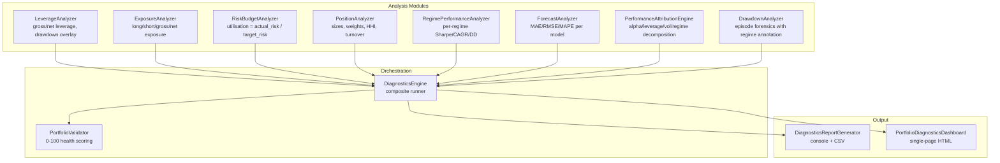

# Portfolio Diagnostics & Validation Framework

## Purpose

Forensic analysis layer that answers the fundamental question:

> **"Why did the portfolio behave the way it did?"**

Provides statistically rigorous evidence for whether performance improvements come from:
- Genuine alpha
- Volatility targeting
- Regime awareness
- Leverage
- Overfitting
- Implementation errors

---

## Architecture



---

## Quick Start

```python
from aqc.diagnostics import DiagnosticsEngine

engine = DiagnosticsEngine(
    equity_series=equity,
    position_values=position_df,
    returns=daily_returns,
    regime_data=regime_df,
    vol_data=vol_forecast_df,
    forecast_vol_series=forecast_vol,
    realised_vol_series=realised_vol,
    target_vol=0.10,
    max_leverage=3.0,
)
results = engine.run_all(output_dir="reports/diagnostics")
```

---

## Modules

### 1. Leverage Analysis

```python
from aqc.diagnostics import LeverageAnalyzer

la = LeverageAnalyzer(equity, position_values, max_leverage=3.0)
df = la.compute()         # gross_leverage, net_leverage per bar
stats = la.stats()        # avg/max/utilisation
la.leverage_by_regime(regime_series)
la.leverage_during_drawdowns(threshold=-0.02)
la.plot(output_dir="reports")
```

**Questions answered:**
- Did leverage explode?
- Did leverage cause performance?
- Did leverage cause drawdowns?

### 2. Exposure Analysis

```python
from aqc.diagnostics import ExposureAnalyzer

ea = ExposureAnalyzer(equity, position_values)
df = ea.compute()  # long/short/gross/net exposure
ea.exposure_by_regime(regime_series)
```

### 3. Risk Budget Analysis

```python
from aqc.diagnostics import RiskBudgetAnalyzer

rb = RiskBudgetAnalyzer(equity, forecast_vol, realised_vol, pos_values, target_vol=0.10)
df = rb.compute()  # utilisation = actual_risk / target_risk
stats = rb.stats()  # pct_over_budget, pct_under_50
```

### 4. Position Analysis

```python
from aqc.diagnostics import PositionAnalyzer

pa = PositionAnalyzer(equity, position_values)
stats = pa.stats()         # avg_size, max_weight, HHI, turnover
top = pa.largest_positions(10)
```

### 5. Regime Performance

```python
from aqc.diagnostics import RegimePerformanceAnalyzer

rpa = RegimePerformanceAnalyzer(returns, regime_data)
vol_perf = rpa.by_vol_regime()    # Sharpe/Sortino/CAGR/DD per vol regime
trend_perf = rpa.by_trend_regime()
contrib = rpa.regime_contribution()
```

### 6. Forecast Validation

```python
from aqc.diagnostics import ForecastAnalyzer

fa = ForecastAnalyzer(vol_data)  # cols: ewma_vol, garch_vol, hist_vol, ensemble_vol, realized_1d
table = fa.accuracy_table()  # MAE, RMSE, MAPE, bias, correlation per model
best = fa.best_model()       # lowest RMSE
fa.error_by_regime(regime_series)
```

### 7. Performance Attribution

```python
from aqc.diagnostics.attribution import PerformanceAttributionEngine

attr = PerformanceAttributionEngine(
    baseline_returns=baseline,
    vol_target_returns=vt_returns,
    regime_returns=regime_returns,
    combined_returns=combined,
    leverage_series=leverage,
)
result = attr.compute()
print(result.to_dict())
# {'Alpha': 0.08, 'Leverage': 0.12, 'Vol Targeting': 0.05, ...}
```

### 8. Drawdown Forensics

```python
from aqc.diagnostics.diagnostics_engine import DrawdownAnalyzer

dd = DrawdownAnalyzer(equity, leverage_series=lev, regime_data=regimes)
events = dd.find_drawdowns()
# DrawdownEvent(start, trough, end, depth_pct, avg_leverage, vol_regime, ...)
```

---

## Portfolio Validator

Automated health check scoring (0-100):

```python
from aqc.diagnostics.diagnostics_engine import PortfolioValidator

validator = PortfolioValidator(
    leverage_stats=lev_stats,
    risk_budget_stats=rb_stats,
    exposure_stats=exp_stats,
    position_stats=pos_stats,
    forecast_accuracy=forecast_list,
    max_leverage=3.0,
)
score = validator.validate()
print(score.to_dict())
# {'Leverage': 92, 'Risk Budget': 88, 'Exposure': 95, ..., 'Overall': 89}
print(score.violations)
# ['Max leverage 4.5 > limit 3.0', ...]
```

### Checks Performed

| Check | Threshold | Penalty |
|-------|-----------|---------|
| Max leverage > limit | `max_leverage` | Up to -40 |
| Leveraged > 50% of time | 50% | -15 |
| Over risk budget > 10% | 10% | Up to -30 |
| Max risk utilisation > 2x | 2.0 | -20 |
| Max gross exposure > 2x | 2.0 | -20 |
| HHI concentration > 0.5 | 0.5 | Up to -30 |
| Max position weight > 50% | 50% | -15 |
| Best RMSE > 5% | 5% | Up to -30 |
| Best correlation < 0.5 | 0.5 | -15 |

---

## HTML Dashboard

```python
from aqc.diagnostics.diagnostics_dashboard import PortfolioDiagnosticsDashboard

dash = PortfolioDiagnosticsDashboard(results, "reports", "dashboard/diagnostics.html")
dash.generate()
```

Produces a dark-mode single-page HTML with:
- Validation scorecards with colour-coded bars
- Embedded PNG panels for all 8 analysis categories
- Summary statistics tables
- Violation alerts

---

## Running

```bash
# Run the full diagnostics research pipeline
python -m examples.run_diagnostics

# Run diagnostics tests only
pytest tests/test_diagnostics.py -v

# Full test suite (281 tests)
pytest tests/ -v
```

---

## Generated Outputs

### Reports (per experiment)

| File | Description |
|------|-------------|
| `leverage_report.csv` | Per-bar gross/net leverage |
| `exposure_report.csv` | Per-bar long/short/gross/net exposure |
| `risk_budget_report.csv` | Per-bar forecast/realised vol, utilisation |
| `position_analysis.csv` | Per-bar HHI, turnover, max weight |
| `regime_performance_report.csv` | Per-regime Sharpe/CAGR/DD |
| `forecast_validation_report.csv` | Per-model MAE/RMSE/correlation |
| `attribution_report.csv` | Return decomposition by source |
| `drawdown_forensics_report.csv` | Top-5 drawdown episodes with annotations |
| `validation_report.csv` | Health scores (0-100) |

### Plots

| File | Description |
|------|-------------|
| `leverage_over_time.png` | 4-panel leverage analysis |
| `exposure_over_time.png` | 4-panel exposure analysis |
| `risk_budget_utilisation.png` | 4-panel risk budget |
| `position_size_distribution.png` | 4-panel position analysis |
| `regime_performance_heatmap.png` | 3-panel regime performance |
| `forecast_error_distribution.png` | 4-panel forecast validation |
| `attribution_breakdown.png` | Waterfall attribution chart |
| `drawdown_forensics.png` | Annotated drawdown timeline |

### Dashboard

| File | Description |
|------|-------------|
| `diagnostics_dashboard.html` | Single-page HTML with all panels |
