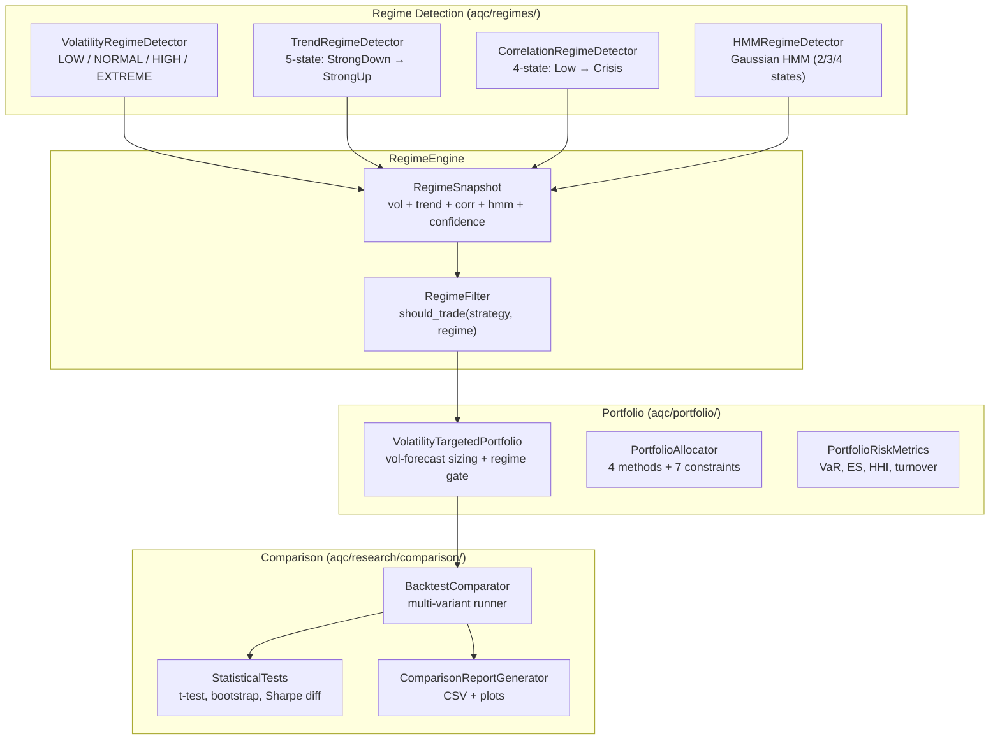

# Regime Detection & Comparative Backtesting Framework

## Overview

The Regime Detection Framework classifies multi-dimensional market states and integrates them into the AQC backtesting pipeline for regime-aware strategy switching and volatility-targeted portfolio construction.

### Research Question

> *"Do volatility targeting and regime awareness improve the risk-adjusted performance of AQC alpha strategies?"*

---

## Architecture



---

## Regime Detectors

### 1. Volatility Regime

| Regime | Description | Detection |
|--------|-------------|-----------|
| LOW | Below 25th percentile of historical vol | Rolling percentile |
| NORMAL | Between 25th and 75th percentile | Rolling percentile |
| HIGH | Between 75th and 95th percentile | Rolling percentile |
| EXTREME | Above 95th percentile | Rolling percentile |

```python
from aqc.regimes import VolatilityRegimeDetector

detector = VolatilityRegimeDetector(window=21, history_length=252)
regime = detector.detect(close_prices)
# VolatilityRegime.NORMAL

df = detector.detect_series(close_prices)
# DataFrame with 'vol' and 'regime' columns
```

### 2. Trend Regime

| Regime | Description | Signals |
|--------|-------------|---------|
| STRONG_UPTREND | High ADX + positive MA slope | ADX > 30, slope > 0.002 |
| UPTREND | Positive MA slope | slope > 0.0005 |
| RANGE_BOUND | Low ADX + flat slope | ADX < 20, slope < 0.0005 |
| DOWNTREND | Negative MA slope | slope < -0.0005 |
| STRONG_DOWNTREND | High ADX + negative MA slope | ADX > 30, slope < -0.002 |

```python
from aqc.regimes import TrendRegimeDetector

detector = TrendRegimeDetector()
regime = detector.detect(ohlc_df)  # needs high/low/close columns
```

### 3. Correlation Regime

Measures average pairwise correlation across a universe of assets.

```python
from aqc.regimes import CorrelationRegimeDetector

detector = CorrelationRegimeDetector()
regime = detector.detect(multi_asset_returns_df)
```

### 4. Hidden Markov Model

Gaussian HMM that discovers latent market states from return data.

```python
from aqc.regimes import HMMRegimeDetector

detector = HMMRegimeDetector(n_states=3)
result = detector.fit(log_returns)
# result.state_labels — per-bar state assignments
# result.transition_matrix — state transition probabilities
# result.means — mean return per state (sorted)
```

> **Note:** Uses `hmmlearn` if installed; otherwise falls back to a pure-numpy Gaussian Mixture Model approximation.

---

## Regime Engine (Composite)

```python
from aqc.regimes import RegimeEngine

engine = RegimeEngine(enable_hmm=True)
snapshot = engine.detect(prices, ohlc_df=ohlc, multi_returns=returns_df)

print(snapshot.volatility_regime)   # VolatilityRegime.NORMAL
print(snapshot.trend_regime)        # TrendRegime.UPTREND
print(snapshot.correlation_regime)  # CorrelationRegime.NORMAL_CORRELATION
print(snapshot.hmm_state_label)     # "Bull"
print(snapshot.confidence)          # 0.6
```

### Full-Series Detection

```python
df = engine.detect_full_series(prices, ohlc_df=ohlc)
# DataFrame: vol_regime | trend_regime | corr_regime | hmm_state
```

### Transition Matrix

```python
transmat = engine.compute_transition_matrix(df["vol_regime"])
# DataFrame: rows=from_state, cols=to_state, values=probability
```

---

## Regime Filter (Strategy Switching)

```python
from aqc.regimes import RegimeFilter

# Default rules for mean-reversion and momentum
filt = RegimeFilter()

# Custom rules
filt = RegimeFilter(rules={
    "mean_reversion": {
        (VolatilityRegime.LOW, TrendRegime.RANGE_BOUND),
        (VolatilityRegime.NORMAL, TrendRegime.RANGE_BOUND),
    },
    "momentum": {
        (VolatilityRegime.NORMAL, TrendRegime.UPTREND),
        (VolatilityRegime.NORMAL, TrendRegime.STRONG_UPTREND),
    },
})

allowed = filt.should_trade("mean_reversion", snapshot)
```

---

## Volatility-Targeted Portfolio

```python
from aqc.portfolio import VolatilityTargetedPortfolio
from aqc.volatility import VolatilityForecastEngine, VolatilitySizer
from aqc.regimes import RegimeEngine, RegimeFilter

vtport = VolatilityTargetedPortfolio(
    event_queue=eq,
    risk_manager=rm,
    vol_engine=VolatilityForecastEngine(),
    vol_sizer=VolatilitySizer(target_vol=0.10),
    regime_engine=RegimeEngine(enable_hmm=False),
    regime_filter=RegimeFilter(),
    strategy_type="mean_reversion",
)
```

### Portfolio Allocator

```python
from aqc.portfolio import PortfolioAllocator, AllocationConstraints

constraints = AllocationConstraints(
    max_position_weight=0.25,
    max_leverage=1.0,
    max_sector_exposure=0.40,
)

allocator = PortfolioAllocator(constraints=constraints)
result = allocator.allocate(
    symbols=["AAPL", "MSFT", "TLT"],
    vols={"AAPL": 0.25, "MSFT": 0.22, "TLT": 0.10},
    method=AllocationMethod.INVERSE_VOL,
)
```

### Portfolio Risk Metrics

```python
from aqc.portfolio import PortfolioRiskMetrics

prm = PortfolioRiskMetrics(daily_returns)
var_95 = prm.historical_var()        # 95% 1-day VaR
es_95 = prm.expected_shortfall()     # 95% CVaR
hhi = prm.concentration_hhi(weights) # HHI concentration
```

---

## Comparative Backtesting

```python
from aqc.research.comparison import BacktestComparator, StatisticalTests

comparator = BacktestComparator()
comparator.add_result("Baseline", eq_curve1, trades1)
comparator.add_result("Enhanced", eq_curve2, trades2)

# Side-by-side metrics
comparison_df = comparator.compare()

# Statistical tests
tests = StatisticalTests()
t_result = tests.t_test_returns(returns_a, returns_b)
sharpe_ci = tests.bootstrap_sharpe_ci(returns_a, n_bootstrap=1000)
sharpe_diff = tests.sharpe_difference_test(returns_a, returns_b)
```

---

## Quick Start

```bash
# Run the full research pipeline
python examples/run_regime_research.py

# Run regime tests
pytest tests/test_regimes.py -v

# Run portfolio/comparison tests
pytest tests/test_portfolio_enhanced.py -v

# Full test suite
pytest tests/ -v
```

---

## Generated Outputs

| File | Description |
|------|-------------|
| `reports/regime_detection_report.csv` | Per-bar regime classifications |
| `reports/volatility_targeting_report.csv` | Side-by-side performance metrics |
| `reports/comparative_backtest_report.csv` | Full comparison table |
| `reports/equity_comparison.png` | Overlaid equity curves |
| `reports/drawdown_comparison.png` | Drawdown comparison |
| `reports/regime_timeline.png` | Vol/trend/corr regime timeline |
| `reports/transition_matrix.png` | Volatility regime transition heatmap |
| `reports/risk_contribution.png` | Risk metric bar chart comparison |
